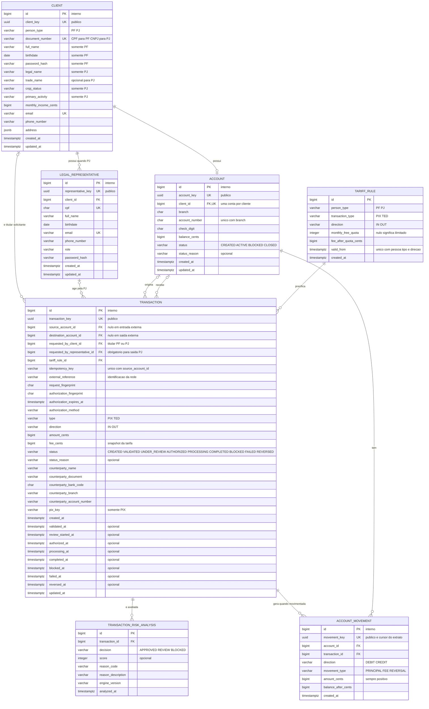

# RFC — Conta transacional PF/PJ com PIX, TED e tarifas

| | |
|---|---|
| **Time** | <preencher nomes do time> |
| **Data** | 05/10/2026 |
| **Versão** | 6 — modelo-alvo de transação, risco e segurança |

## Contextualização

### Entendendo o problema

O sistema deve cadastrar pessoas físicas e jurídicas, abrir uma conta para cada cliente e permitir recebimentos, transferências e consulta de extrato por PIX ou TED. A pessoa física é identificada somente pelo CPF; a pessoa jurídica é identificada pelo CNPJ e opera por meio de representante legal. Toda solicitação precisa ser rastreável desde sua criação, mesmo quando for bloqueada ou falhar, enquanto toda movimentação deve manter saldo e extrato consistentes sob concorrência e repetição. O produto também deve aplicar a tarifa correta por tipo de cliente, modalidade e quantidade de operações concluídas no mês. Ficam fora desta entrega cartões, boletos, crédito, conta conjunta, múltiplas contas por cliente, integração real com SPI/STR e uma plataforma completa de PLD/FT.

### Explicando a solução de forma macro

Um único `Client`, discriminado por `person_type`, representa PF ou PJ; `LegalRepresentative` existe apenas para PJ, e `Account` concentra seu próprio estado e saldo. `Transaction` nasce antes da movimentação e conserva solicitante, pedido, contraparte, tarifa e ciclo de vida por estados explícitos. Cada avaliação cria um `TransactionRiskAnalysis`, preservando inclusive bloqueios e revisões. Somente uma transação autorizada gera `AccountMovement`: lançamentos imutáveis de principal, tarifa ou estorno que formam o extrato. `TariffRule` possui regras explícitas inclusive para operações gratuitas, e a transação guarda a regra e a tarifa aplicadas. Os nomes são equivalentes entre tabela e implementação — por exemplo, `account_movement`/`AccountMovement` e `tariff_rule`/`TariffRule` — e as colunas usam os mesmos nomes dos atributos das classes.

- **Separar clientes PF e PJ em tabelas independentes** — descartado porque duplicaria identidade, contato e relacionamentos com conta. Ganharia se os dois cadastros passassem a ter ciclos de vida e equipes totalmente independentes.
- **Criar uma entidade separada para tentativa de transferência** — descartado porque a própria `Transaction`, criada em `CREATED`, consegue registrar validação, risco, autorização e desfecho. Ganharia se intenção e liquidação fossem produtos ou serviços independentes.
- **Guardar somente o estado atual sem análise de risco persistida** — descartado porque mostraria que houve bloqueio, mas não sua decisão, motivo ou versão do mecanismo. Ganharia em um sistema sem avaliação de risco.
- **Persistir uma tabela de extrato** — descartado porque duplicaria os movimentos e poderia divergir após estornos. Ganharia como projeção assíncrona reconstruível, caso métricas reais justificassem.

## Implementação

### Rotas

As rotas abaixo são a base do contrato e ainda serão revistas antes de se tornarem definitivas. Nomes, granularidade dos webhooks, autenticação e paginação do extrato poderão mudar sem alterar as garantias do modelo.

| Método | Caminho | O que faz | Entrada (campos que importam) | Saídas (status e quando) |
|---|---|---|---|---|
| `POST` | `/clients` | Cadastra PF ou PJ | `person_type`; CPF, nome, nascimento e credencial para PF; CNPJ, razão social e `legal_representative` para PJ; contato e endereço | `201` com `client_key`; `400` combinação incompatível; `422` documento, nascimento ou situação cadastral inválida; `409` documento, CPF de representante ou e-mail repetido. Não é idempotente; restrições únicas evitam duplicação. |
| `GET` | `/clients/{client_key}` | Consulta cliente | `client_key` | `200`; `404` cliente inexistente. Idempotente por ser leitura. |
| `POST` | `/clients/{client_key}/accounts` | Abre conta | `client_key`; corpo vazio | `201` com `account_key`; `404` cliente inexistente; `409` cliente já possui conta. `UNIQUE(client_id)` impede uma segunda conta. |
| `GET` | `/accounts/{account_key}` | Consulta conta e saldo | `account_key` | `200`; `404` conta inexistente. Idempotente por ser leitura. |
| `PATCH` | `/accounts/{account_key}` | Altera o estado da conta | `status`, `reason` | `200`; `400` corpo inválido; `404` conta inexistente; `409` transição proibida ou encerramento com saldo. Repetir o estado atual não produz novo efeito. |
| `POST` | `/accounts/{account_key}/transactions` | Cria e valida uma intenção PIX/TED | cabeçalho `Idempotency-Key`; `type`, `amount_cents` e destino | `201` com transação `CREATED`, `VALIDATED`, `UNDER_REVIEW` ou `BLOCKED`; `200` na repetição idêntica; `400` corpo ou chave inválida; `404` conta ou destino inexistente; `409` chave reutilizada com outro pedido; `422` regra de negócio recusada. Idempotente por `(source_account_id, idempotency_key)`. |
| `POST` | `/transactions/{transaction_key}/authorizations` | Confirma destino, valor e tarifa com MFA | prova de autenticação de uso único | `200/202` em `PROCESSING` ou `COMPLETED`; `401` prova inválida; `404` transação inexistente ou alheia; `409` estado, expiração ou fingerprint incompatível; `422` risco, tarifa alterada ou saldo recusado. A autorização é vinculada ao snapshot financeiro. |
| `POST` | `/webhooks/transactions` | Registra confirmação ou recebimento externo | autenticação interna, referência externa, tipo, valor, destino e contraparte | `201` criado; `200` na repetição idêntica; `400` corpo inválido; `404` conta inexistente; `409` referência reutilizada com outro conteúdo. Idempotente pela identificação da rede. |
| `GET` | `/transactions/{transaction_key}` | Consulta estado e comprovante | `transaction_key` | `200`; `404` transação inexistente ou alheia. Idempotente por ser leitura. |
| `GET` | `/accounts/{account_key}/transactions` | Retorna extrato | período ou cursor e limite | `200` com lançamentos e paginação; `400` filtro inválido; `404` conta inexistente. O contrato definitivo de paginação ainda será revisto. |

### Banco de Dados (Somente diagrama)

### Fluxos

**Cadastro de cliente — caminho feliz**

1. A API valida os campos comuns e escolhe as regras pelo `person_type`.
2. Para PF, valida CPF, nome, nascimento e credencial, sem aceitar campos de PJ; para PJ, valida CNPJ, situação cadastral e um representante legal adulto.
3. Cliente e representante, quando aplicável, são gravados na mesma transação, e a resposta expõe somente `client_key`.

**Cadastro de cliente — falha: tipo ou identidade inválida**

1. Combinação incompatível recebe `400`, dado inválido recebe `422` e documento, CPF de representante ou e-mail repetido recebe `409`.
2. A transação de banco é revertida por inteiro; nenhum cadastro parcial permanece.

**Abertura e manutenção da conta — caminho feliz**

1. O serviço localiza o cliente e verifica a restrição de uma conta por cliente.
2. Cria a conta em `CREATED` e a altera para `ACTIVE` na mesma transação de banco; mudanças posteriores atualizam `status`, `status_reason` e `updated_at`.

**Abertura e manutenção da conta — falha: conta duplicada ou transição inválida**

1. `UNIQUE(client_id)` impede uma segunda conta mesmo sob requisições simultâneas.
2. Uma transição proibida ou o encerramento com saldo recebe `409` sem alteração parcial.

**PIX/TED de saída — caminho feliz**

1. O serviço autentica a PF ou o representante, confirma sua autorização sobre a conta e valida `Idempotency-Key`. Cria `Transaction` em `CREATED`, registrando sempre `requested_by_client_id` e, para PJ, também `requested_by_representative_id`.
2. Valida conta, destino, valor e limites; fotografa a contraparte, calcula `request_fingerprint` e altera a transação para `VALIDATED`. A partir daqui, origem, destino, valor e pedido não podem ser alterados.
3. Executa a política de risco e insere `TransactionRiskAnalysis`. `BLOCKED` encerra a transação sem movimento; `REVIEW` a deixa `UNDER_REVIEW`; `APPROVED` permite preparar a autorização.
4. Sob trava da conta, conta somente transações `COMPLETED` da mesma modalidade no mês de `America/Sao_Paulo` e seleciona a `TariffRule` vigente. PF e entradas usam regra explícita de tarifa zero; PJ usa franquia de 20 PIX ou 2 TEDs e, depois dela, tarifa de 99 ou 499 centavos.
5. Grava `tariff_rule_id` e `fee_cents`, apresenta contraparte, valor e tarifa e emite desafio de MFA vinculado ao `authorization_fingerprint`. Se a tarifa mudar antes da confirmação, invalida o desafio e exige nova apresentação, sem cobrar silenciosamente.
6. Uma prova válida altera a transação para `AUTHORIZED`. O serviço trava as contas em ordem estável, relê saldo e tarifa e passa para `PROCESSING`.
7. Na mesma transação ACID, atualiza o saldo e cria `AccountMovement` de principal e, quando `fee_cents > 0`, de tarifa. A conclusão altera o estado para `COMPLETED`.

**PIX/TED de saída — falha: risco, concorrência ou integração externa**

1. Risco bloqueado mantém a transação em `BLOCKED`, com motivo e análises preservados, mas sem movimento financeiro.
2. Operações simultâneas aguardam a trava da conta; a segunda relê saldo, quantidade mensal e tarifa. Saldo insuficiente ou falha definitiva deixa a transação em `FAILED`, sem movimento parcial.
3. Repetição com a mesma chave e fingerprint devolve a transação existente em qualquer estado; a mesma chave com pedido diferente recebe `409`.
4. Uma resposta externa inconclusiva mantém `PROCESSING` para reconciliação. Falha após conclusão nunca apaga lançamentos: cria movimentos inversos e altera a transação para `REVERSED`.

> ## Principal desafio
>
> - **Qual é:** preservar rastreabilidade sem permitir débito duplicado, saldo negativo ou franquia incorreta sob concorrência e retentativas.
> - **Por que é difícil:** a solicitação existe antes do dinheiro se mover, chamadas externas podem terminar sem resposta e duas operações podem disputar saldo e a última posição gratuita.
> - **Como o desenho resolve:** estados e análises preservam decisões; fingerprints e idempotência fixam o pedido; travas serializam saldo e tarifa; e saldo, movimentos e estado financeiro são confirmados atomicamente, com estornos sempre aditivos.

**PIX/TED de entrada — caminho feliz**

1. O endpoint interno valida a origem e a referência da rede e cria `Transaction` associada a uma `TariffRule` explícita de tarifa zero.
2. Localiza e trava a conta, cria `AccountMovement` de crédito e altera a transação para `COMPLETED` no mesmo commit do saldo.
3. A repetição da referência e conteúdo devolve a transação existente sem novo crédito.

**PIX/TED de entrada — falha: evento repetido ou conta inválida**

1. Referência existente com conteúdo diferente recebe `409`; conta inexistente recebe `404`; conta inativa mantém a tentativa em `FAILED` sem crédito.
2. Nenhum movimento parcial permanece após rollback.

**Consulta de extrato — caminho feliz**

1. O serviço valida conta, filtros e cursor público `movement_key`.
2. Lê `AccountMovement`, associa cada lançamento à `Transaction` e retorna principal, tarifas, estornos, saldo após cada movimento e paginação.

**Consulta de extrato — falha: consulta inválida**

1. Cursor de outra conta, período ou paginação inválida recebe erro de contrato; conta inexistente recebe `404`.
2. Como a consulta não altera estado, a falha não exige compensação.

**Direção de segurança.** O `INTERNAL-TOKEN` fica restrito à autenticação entre serviços. PF e representante devem ser autenticados por um serviço de identidade que emita token curto com o vínculo ao cliente; cada operação verifica a titularidade da conta e transferências exigem MFA de uso único sobre o fingerprint de origem, destino, valor e tarifa. Solicitante, análises de risco e estados permanecem vinculados à transação, enquanto tentativas de autenticação, dispositivo e eventos de segurança seguem para auditoria própria.

**Limitações atuais.** O modelo define o fluxo-alvo, mas autenticação do usuário, MFA, análise de risco, novos estados e os renomes de `Entry`/`FeeRule` ainda precisam ser implementados. Em produção também serão necessários criptografia em trânsito e repouso, gestão centralizada de segredos e chaves, menor privilégio, limitação de requisições, auditoria protegida e controles completos de fraude e PLD/FT. Em escala, contas muito movimentadas podem gerar contenção; métricas devem orientar índices, particionamento e adoção de outbox e reconciliação assíncrona sem enfraquecer as garantias financeiras.
