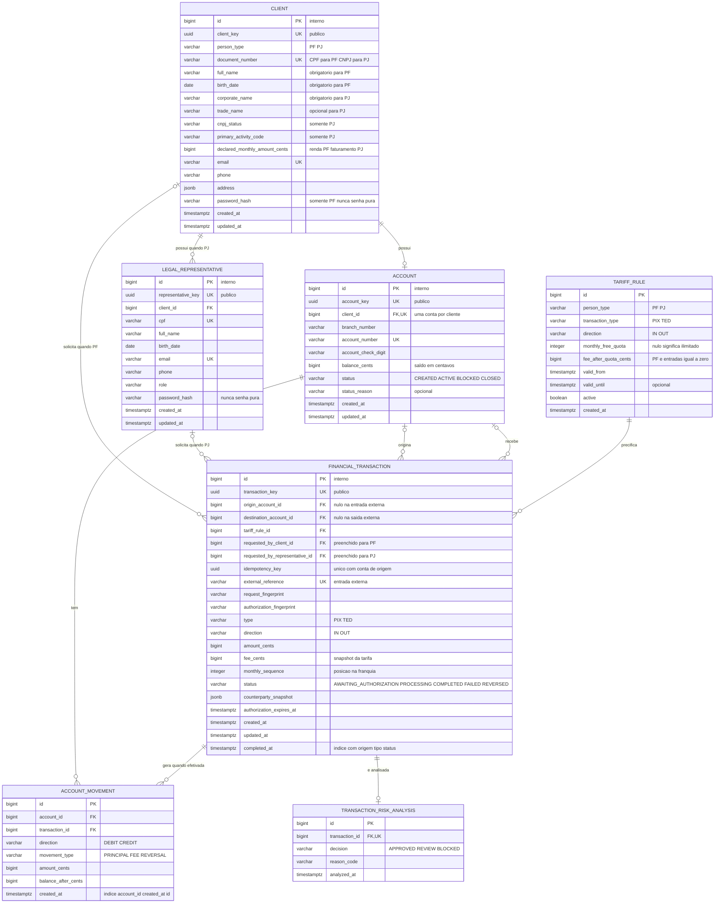

# RFC — Conta transacional PF/PJ com PIX, TED e tarifas

| | |
|---|---|
| **Time** | <preencher nomes do time> |
| **Data** | 05/10/2026 |
| **Versão** | 4 — clientes PF/PJ e tarifa por franquia mensal |

## Contextualização

### Entendendo o problema

O sistema deve cadastrar pessoas físicas e jurídicas, abrir uma conta para cada cliente e permitir recebimentos, transferências e consulta de extrato por PIX ou TED. A pessoa física é identificada somente pelo CPF e não depende de CNPJ nem de representante legal; a pessoa jurídica é identificada pelo CNPJ e opera por meio de representante legal. Toda movimentação precisa manter saldo e extrato consistentes, mesmo sob requisições simultâneas ou repetidas. O produto também deve aplicar a tarifa correta por tipo de cliente, modalidade e quantidade de operações no mês, sem cobrar duas vezes ou ultrapassar a franquia por efeito de concorrência. Ficam fora desta entrega cartões, boletos, crédito, conta conjunta, integração real com SPI/STR, múltiplas contas por cliente e uma plataforma completa de PLD/FT.

### Explicando a solução de forma macro

Um único cadastro de `client`, discriminado por `person_type`, guarda os campos comuns e os dados condicionais de CPF ou CNPJ; `legal_representative` existe apenas para PJ. A conta concentra seu próprio estado e saldo, enquanto cada PIX/TED gera uma `financial_transaction` e movimentos imutáveis em `account_movement`, dos quais o extrato é calculado. Regras versionadas em `tariff_rule` e a quantidade de saídas concluídas pela conta no mês determinam a tarifa: PF não paga por PIX ou TED; PJ recebe gratuitamente, envia os primeiros 20 PIX do mês sem custo e paga R$ 0,99 a partir do 21º, enquanto envia os primeiros 2 TEDs sem custo e paga R$ 4,99 a partir do 3º. A conta é travada durante esse cálculo e a operação conserva uma cópia da regra, da posição mensal e da tarifa aplicada.

- **Separar clientes PF e PJ em tabelas independentes** — descartado porque duplicaria identidade, contato e relacionamentos com conta. Ganharia se os dois cadastros passassem a ter ciclos de vida e equipes totalmente independentes.
- **Guardar somente o saldo na conta** — descartado porque não explicaria sua formação nem permitiria reconstruir o extrato. Ganharia em uma prova de conceito sem auditoria financeira.
- **Persistir uma tabela de extrato** — descartado porque duplicaria os movimentos e poderia divergir após estornos. Ganharia se fosse uma projeção assíncrona, reconstruível e otimizada para grande volume.
- **Criar tabelas diferentes para PIX e TED** — descartado porque repetiria estados, idempotência e regras de saldo. Ganharia se as modalidades tivessem ciclos operacionais incompatíveis.

## Implementação

### Rotas

| Método | Caminho | O que faz | Entrada (campos que importam) | Saídas (status e quando) |
|---|---|---|---|---|
| `POST` | `/clients` | Cadastra PF ou PJ | `person_type`; CPF, nome e nascimento para PF; CNPJ, razão social e `legal_representative` para PJ; contato e endereço | `201` com `client_key`; `400` combinação de campos incompatível com o tipo; `422` CPF/CNPJ inválido; `409` documento ou e-mail já cadastrado. Não é idempotente; as restrições únicas impedem duplicação. |
| `GET` | `/clients/{client_key}` | Consulta um cliente | `client_key` | `200` com dados adequados ao tipo; `404` cliente inexistente. Idempotente por ser leitura. |
| `POST` | `/clients/{client_key}/accounts` | Abre a conta do cliente | `client_key` | `201` com `account_key`; `404` cliente inexistente; `409` cliente já possui conta; `422` cadastro incompleto ou inelegível. Não é idempotente; a unicidade de `client_id` evita uma segunda conta. |
| `GET` | `/accounts/{account_key}` | Consulta conta e saldo | `account_key` | `200`; `404` conta inexistente. Idempotente por ser leitura. |
| `PATCH` | `/accounts/{account_key}` | Altera o estado da conta | `status`, `reason` | `200`; `400` corpo inválido; `404` conta inexistente; `409` transição proibida. Repetir o mesmo estado e motivo devolve o estado atual sem novo efeito. |
| `POST` | `/accounts/{account_key}/transactions` | Cria uma intenção de PIX/TED de saída e calcula a tarifa | cabeçalho `Idempotency-Key`; `type`, `amount_cents` e destino | `201` em `AWAITING_AUTHORIZATION`; `200` ao repetir chave e corpo; `400` corpo inválido; `404` conta inexistente; `409` chave reutilizada com outro corpo ou conta inativa; `422` destino, limite, risco ou saldo recusado. Idempotente por `(account_id, idempotency_key)`. |
| `POST` | `/transactions/{transaction_key}/authorizations` | Autoriza o snapshot de destino, valor e tarifa | prova de autenticação de uso único | `200` concluída ou `202` em processamento; `400` tentativa de alterar dado financeiro; `401` prova inválida; `404` transação inexistente; `409` expirada, já autorizada ou tarifa recalculada; `422` risco ou saldo recusado. A mesma transação não pode ser debitada novamente. |
| `POST` | `/webhooks/transactions` | Registra PIX/TED de entrada confirmado | autenticação interna; `external_reference`, `type`, `amount_cents`, conta destino e remetente | `201` crédito criado; `200` na repetição idêntica; `400` corpo inválido; `404` conta inexistente; `409` referência repetida com outro conteúdo ou conta encerrada. Idempotente por `external_reference`. |
| `GET` | `/transactions/{transaction_key}` | Consulta estado e comprovante | `transaction_key` | `200`; `404` transação inexistente ou alheia. Idempotente por ser leitura. |
| `GET` | `/accounts/{account_key}/transactions` | Retorna extrato por período | `created_from`, `created_to`, `limit`, `page` | `200` com saldos e lançamentos; `400` período ou paginação inválidos; `404` conta inexistente. Idempotente por ser leitura. |

### Banco de Dados (Somente diagrama)

### Fluxos

**Cadastro de cliente — caminho feliz**

1. A API valida os campos comuns e escolhe as regras pelo `person_type`.
2. Para PF, normaliza e valida CPF, nome e nascimento, sem aceitar CNPJ ou representante; para PJ, valida CNPJ, razão social e ao menos um representante legal.
3. Cliente e representante, quando aplicável, são gravados em uma única transação, e a resposta expõe somente as chaves públicas.

**Cadastro de cliente — falha: tipo ou identidade inválida**

1. Uma combinação incompatível de campos recebe `400`, documento inválido recebe `422` e documento ou e-mail repetido recebe `409`.
2. A transação é revertida por inteiro; nenhum cliente ou representante parcial permanece.

**Abertura e manutenção da conta — caminho feliz**

1. O serviço localiza o cliente, confirma que o cadastro obrigatório do tipo está completo e verifica a restrição de uma conta por cliente.
2. Cria a conta com saldo zero e `status=ACTIVE`; bloqueios e encerramentos posteriores atualizam o estado, motivo e `updated_at` na própria conta.

**Abertura e manutenção da conta — falha: conta duplicada ou transição inválida**

1. A unicidade de `client_id` impede uma segunda conta mesmo sob requisições simultâneas.
2. Cadastro incompleto recebe `422`; uma transição de estado proibida recebe `409` sem alterar a conta.

**PIX/TED de saída — caminho feliz**

1. O serviço autentica o cliente PF ou representante de PJ e consulta `(account_id, idempotency_key)`; repetição idêntica devolve o resultado existente.
2. Após validar conta, destino, valor e risco, conta as saídas `COMPLETED` da mesma conta e modalidade no mês-calendário de `America/Sao_Paulo` e calcula a tarifa prevista.
3. Para PF, aplica tarifa zero. Para PJ, PIX de número 1 a 20 custa zero e do 21 em diante custa 99 centavos; TED de número 1 a 2 custa zero e do 3 em diante custa 499 centavos. Entradas não consomem franquia e não têm tarifa.
4. A regra, a posição mensal prevista e a tarifa são copiadas para a transação e vinculadas ao desafio de autorização; o cliente confirma exatamente destino, principal e tarifa.
5. Na autorização, o banco trava a conta, relê o saldo e reconta suas saídas concluídas no mês. Se a tarifa permanecer igual à autorizada, grava o movimento `PRINCIPAL` e, quando houver cobrança, o movimento `FEE`, atualiza o saldo e marca a transação como `COMPLETED` na mesma transação ACID.

**PIX/TED de saída — falha: concorrência, repetição ou saldo insuficiente**

1. Operações simultâneas para a mesma conta/modalidade aguardam a mesma trava; somente uma ocupa a última posição gratuita. Se a tarifa recalculada for diferente da apresentada, a outra recebe `409`, não é debitada e ganha um novo desafio com a tarifa correta para confirmar conscientemente.
2. Saldo insuficiente ou falha de persistência desfaz movimentos, saldo e mudança de estado. A operação recebe `422` ou permanece em estado rastreável para reconciliação, sem débito parcial.
3. A mesma chave com o mesmo corpo não cria nova cobrança; a mesma chave com corpo diferente recebe `409`.

> ## Principal desafio
>
> - **Qual é:** manter saldo, franquia mensal e tarifa consistentes quando existem operações concorrentes e retentativas.
> - **Por que é difícil:** contar as transações e debitar depois, sem serialização, permitiria que duas operações ocupassem a mesma posição gratuita, enquanto uma falha intermediária poderia atualizar apenas parte dos registros.
> - **Como o desenho resolve:** na autorização, trava a conta, reconta suas saídas concluídas no mês e exige nova confirmação se a tarifa tiver mudado; com tarifa confirmada, usa idempotência e grava tarifa, movimentos, saldo e conclusão na mesma transação ACID, com rollback integral em qualquer erro.

**PIX/TED de entrada — caminho feliz**

1. A integração autentica a origem, valida `external_reference` e localiza a conta ativa.
2. Sob trava da conta, grava a transação com tarifa zero, o movimento de crédito e o novo saldo no mesmo commit.
3. A repetição da mesma referência e conteúdo devolve o registro existente sem novo crédito.

**PIX/TED de entrada — falha: evento repetido ou conta inválida**

1. Referência existente com conteúdo diferente recebe `409`; conta inexistente recebe `404`; conta encerrada recebe `409`.
2. Nenhum crédito parcial permanece após o rollback.

**Consulta de extrato — caminho feliz**

1. O serviço valida a conta, o período e a paginação e lê `account_movement` ordenado por `(created_at, id)`.
2. Associa cada movimento à transação e retorna saldo inicial, créditos, débitos, tarifas, estornos e saldo final.

**Consulta de extrato — falha: consulta inválida**

1. Período invertido, excessivo ou paginação inválida recebe `400`; conta inexistente recebe `404`.
2. Como a consulta não altera estado, a falha não exige compensação.

**Limitações atuais.** O desenho garante consistência transacional e idempotência, mas ainda não representa sozinho a segurança exigida em produção: seriam necessários autenticação multifator, criptografia em trânsito e em repouso, gestão de segredos e chaves, menor privilégio, limitação de requisições, auditoria centralizada e controles mais completos de fraude e PLD/FT. Em escala, a trava por conta preserva o saldo, porém contas muito movimentadas podem se tornar pontos de contenção, e a contagem mensal sobre transações tende a ficar mais cara com o crescimento do histórico; índices atendem ao volume inicial, enquanto particionamento, processamento assíncrono com outbox e projeções reconstruíveis devem ser avaliados conforme métricas reais, sem enfraquecer as garantias financeiras.
