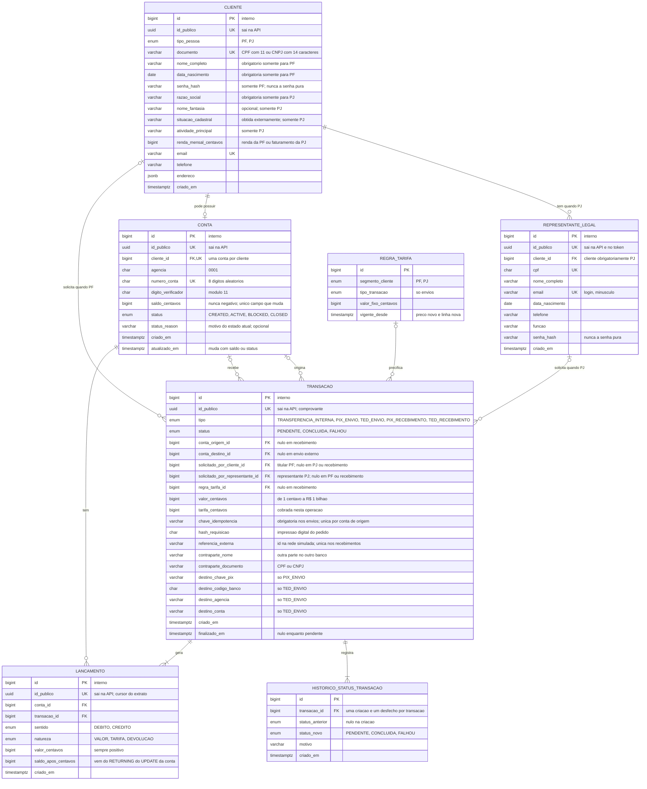

# RFC — Conta transacional PF/PJ com PIX e TED

| | |
|---|---|
| **Time** | <preencher nomes do time> |
| **Data** | 03/10/2026 |
| **Versão** | 5 — modelo generalista para pessoa física e jurídica |

## Contextualização

### Entendendo o problema

O sistema oferece o cadastro de clientes pessoa física ou jurídica, a abertura de conta vinculada ao cliente, a consulta de saldo e a movimentação por PIX ou TED. Cada movimentação pode gerar tarifa e deve aparecer em um extrato paginado. A principal garantia é que dinheiro não seja criado, perdido, cobrado duas vezes ou gasto após o saldo acabar, inclusive quando duas requisições chegam juntas ou uma requisição é reenviada. O histórico precisa explicar o saldo atual sem permitir que uma alteração apague o que aconteceu. Também é necessário barrar clientes, contas e transações incompatíveis com as regras de cadastro e de risco. Ficam fora desta versão cartões, boletos, saques, crédito, juros, câmbio, conta conjunta, integração real com SPI/STR e uma plataforma completa de PLD/FT; os pontos de integração externa serão representados por contratos e estados.

### Explicando a solução de forma macro

O modelo inicialmente levantado pelo time foi: `Cliente(id, CNPJ, email, senha, endereço, número de contato, token)`; `Conta(id, cliente_id, número da conta, status, timestamp)`; `Transação(id, conta_id, timestamp, status, valor, destino, tipo PIX/TED, entrada/saída, tarifa_cobrada)`; `Extrato(id, transação_id, cobertura_temporal)`; `Tarifa(id, tarifa_pix, tarifa_ted, transação_id)`; e `Banco(id, clientes_id, CNPJ, balanço_financeiro, local_de_depósito)`. Esta versão generaliza `Cliente`: o documento passa a ser CPF ou CNPJ e `person_type` determina quais dados condicionais são válidos.

A proposta final mantém Cliente, Conta, Transação e Tarifa, admite PF e PJ na mesma tabela de cliente, associa representante legal somente à PJ e separa a operação financeira dos movimentos imutáveis que alteram uma conta. O saldo corrente fica em `account` para consulta rápida; cada débito, crédito, tarifa ou estorno fica em `account_movement`, permitindo reconstrução e conciliação. A mesma transação ACID trava a conta, grava os movimentos e atualiza o saldo. O extrato passa a ser uma consulta por período sobre esses movimentos, não uma entidade. A tarifa vira uma regra com vigência, e a transação guarda uma cópia do valor efetivamente cobrado.

Para PF, os dados básicos são CPF, nome completo, nascimento, renda mensal informada, contato, endereço e senha. Para PJ, são CNPJ, razão social, nome fantasia opcional, situação cadastral do CNPJ (obtida por fonte cadastral), atividade principal, faturamento mensal informado, contato e endereço; também se identifica ao menos um representante legal com CPF, nome, nascimento, contato, função e senha. Esta é uma modelagem acadêmica mínima, não uma lista universal de conformidade: a [Resolução CMN nº 4.753](https://normativos.bcb.gov.br/Lists/Normativos/Attachments/50847/Res_4753_v6_L.pdf) exige procedimentos para identificar e qualificar titulares e representantes, validar autenticidade e conhecer perfil de risco/capacidade econômico-financeira.

Cliente e representante legal são dados cadastrais, não máquinas de estado. Nesta versão eles não recebem `status` nem tabela de histórico: existir uma linha significa que o cadastro foi aceito. PF não possui representante legal; o próprio cliente é o titular autenticado. PJ possui ao menos um representante. O ciclo de vida operacional pertence à conta, que terá `status`, `status_reason`, `created_at` e `updated_at`. Encerrar uma conta altera seu estado para `CLOSED`; não apaga conta, cliente ou representante.

`financial_transaction` representa a operação única e seu comprovante. `account_movement` representa cada efeito no saldo e cada linha do extrato: um PIX de R$ 100,00 com tarifa de R$ 2,00 produz uma transação, um movimento de débito de 10.000 centavos e outro de tarifa de 200 centavos. Nesta fase, a situação atual e o motivo ficam na própria conta; uma tabela separada de histórico de status poderá ser introduzida quando houver requisito de auditoria dessa transição. `transaction_risk_analysis` conserva a decisão antifraude e um motivo legível. Entidades expostas pela API têm `..._key`; tabelas internas de detalhe usam somente `id`.

**Como a entrega de extrato é atendida:** o extrato é a representação retornada por `GET /accounts/{account_key}/transactions`, não uma tabela adicional. A API recebe período e paginação, busca os `account_movement` daquela conta, associa cada movimento à sua `financial_transaction` e devolve saldo inicial, créditos, débitos, tarifas, estornos e saldo final. Não persistir uma cópia do extrato evita divergência quando uma transação é estornada. O índice `(account_id, created_at, id)` mantém a consulta eficiente e a ordenação estável.

- **Manter exatamente o modelo inicial** — descartado porque `extrato` duplicaria dados, a tarifa ficaria invertida em relação à transação, `destino` seria texto sem estrutura e não haveria trilha capaz de reconciliar o saldo. Ganharia se o objetivo fosse apenas uma demonstração descartável, sem concorrência ou auditoria.
- **Calcular sempre o saldo pela soma das transações** — descartado porque encarece toda consulta e torna bloqueio de saldo concorrente mais difícil. Ganharia em um livro-razão completo, com infraestrutura de ledger e projeções assíncronas.
- **Guardar somente o saldo na conta** — descartado porque é rápido, mas não explica como o saldo foi formado nem produz um extrato auditável. Ganharia se não existisse exigência de histórico financeiro.
- **Criar tabelas diferentes para PIX e TED** — descartado porque duplica regras e obriga o extrato a unir fontes. Ganharia se os dois meios tivessem ciclos, campos e times completamente independentes.
- **Criar a entidade `bank`** — descartado porque há um único banco, que é o próprio sistema, e `clientes_id` criaria uma relação redundante. Ganharia em uma plataforma multi-instituição; nesse caso, a entidade representaria instituições participantes, não balanço financeiro mutável.
- **Criar tabelas separadas `individual_client` e `company_client`** — descartado por enquanto para manter cadastro, conta e consultas simples. A tabela única aceita alguns campos nulos, mas constraints condicionais garantem que PF tenha somente os dados de pessoa física e PJ somente os dados empresariais. A separação em subtipos volta a ser considerada se os dois cadastros passarem a evoluir de forma muito diferente.- **Manter exatamente o modelo inicial** — descartado porque `extrato` duplicaria dados, a tarifa ficaria invertida em relação à transação, `destino` seria texto sem estrutura e não haveria trilha capaz de reconciliar o saldo. Ganharia se o objetivo fosse apenas uma demonstração descartável, sem concorrência ou auditoria.
- **Calcular sempre o saldo pela soma das transações** — descartado porque encarece toda consulta e torna bloqueio de saldo concorrente mais difícil. Ganharia em um livro-razão completo, com infraestrutura de ledger e projeções assíncronas.
- **Guardar somente o saldo na conta** — descartado porque é rápido, mas não explica como o saldo foi formado nem produz um extrato auditável. Ganharia se não existisse exigência de histórico financeiro.
- **Criar tabelas diferentes para PIX e TED** — descartado porque duplica regras e obriga o extrato a unir fontes. Ganharia se os dois meios tivessem ciclos, campos e times completamente independentes.
- **Criar a entidade `bank`** — descartado porque há um único banco, que é o próprio sistema, e `clientes_id` criaria uma relação redundante. Ganharia em uma plataforma multi-instituição; nesse caso, a entidade representaria instituições participantes, não balanço financeiro mutável.
- **Criar tabelas separadas `individual_client` e `company_client`** — descartado por enquanto para manter cadastro, conta e consultas simples. A tabela única aceita alguns campos nulos, mas constraints condicionais garantem que PF tenha somente os dados de pessoa física e PJ somente os dados empresariais. A separação em subtipos volta a ser considerada se os dois cadastros passarem a evoluir de forma muito diferente.

As premissas desta versão são: clientes podem ser PF, identificados por CPF, ou PJ, identificados por CNPJ; `document_number` é único e normalizado sem pontuação; cada cliente pode ter uma conta no MVP; valores são inteiros em centavos; chaves UUID são expostas pela API e IDs inteiros ficam internos. Para PF, `password_hash` fica no cadastro do próprio titular; para PJ, fica no representante legal. Token de acesso não é atributo permanente e, se autenticação entrar no escopo, deverá ser expirável e armazenado somente como hash. Dados de destinatário externo são fotografados na transação para que mudanças posteriores não alterem o comprovante.

### Invariantes do cliente generalista

- `person_type = PF` exige CPF, `segment = PF`, nome completo, nascimento e `password_hash`; campos empresariais ficam nulos e não existe representante legal.
- `person_type = PJ` exige CNPJ, razão social, situação cadastral e atividade principal; `password_hash` do cliente fica nulo e existe ao menos um representante legal.
- CPF tem 11 caracteres e CNPJ tem 14 depois da normalização. O formato e os dígitos verificadores são validados no domínio; `CHECK` no banco protege a combinação de tipo e tamanho.
- O mesmo CPF não pode representar dois titulares PF. O CPF de um representante também é único na tabela de representantes; uma regra de domínio impede que um CPF de titular seja reutilizado como representante de outro cliente.
- A criação de PJ e de seu primeiro representante ocorre na mesma transação; assim, a regra “PJ tem representante” não depende de aceitar um cadastro parcial.
- Em uma transação de saída, exatamente um solicitante é preenchido: `requested_by_client_id` para PF ou `requested_by_representative_id` para PJ. Em recebimentos, ambos ficam nulos.

Os controles de identidade, autenticação, autorização, concorrência, antifraude e auditoria estão detalhados no [documento de blindagem por camadas](docs/blindagem.md).

## Implementação

### Rotas

| Método | Caminho | O que faz | Entrada (campos que importam) | Saídas (status e quando) |
|---|---|---|---|---|
| `POST` | `/clients` | Cadastra PF ou PJ | `person_type`; dados comuns; campos de PF ou de PJ; `legal_representative` obrigatório somente para PJ | `201` com `client_key`; `400` combinação de campos inválida; `422` CPF/CNPJ inválido, cadastro inelegível ou pessoa menor de idade; `409` documento ou e-mail já cadastrado. Não é idempotente; unicidade impede duplicata, mas a repetição recebe conflito. |
| `GET` | `/clients/{client_key}` | Consulta cliente | UUID no caminho | `200`; `404` chave inexistente. Idempotente por ser somente leitura. |
| `POST` | `/clients/{client_key}/accounts` | **Planejada:** abre conta para um cadastro existente | tipo da conta; `client_key` no caminho | `201` com `account_key`; `400` corpo inválido; `404` cliente inexistente; `409` cadastro inelegível ou cliente já possui a conta permitida. Não é idempotente nesta versão. |
| `POST` | `/onboardings` | **Planejada:** executa cadastro e abertura de conta em uma única transação | os mesmos dados discriminados de `/clients` e o tipo da conta | `201` com `client_key` e `account_key`; qualquer falha reverte cadastro, representante quando PJ e conta. Será a operação preferencial do futuro SDK. |
| `GET` | `/accounts/{account_key}` | Consulta conta e saldo | UUID no caminho | `200`; `404` chave inexistente. Idempotente por ser somente leitura. |
| `PATCH` | `/accounts/{account_key}` | Bloqueia, reativa ou encerra conta | `status`, `reason` | `200`; `400` corpo inválido; `404` conta inexistente; `409` transição de estado proibida. Idempotente quando repete o mesmo estado e motivo. |
| `POST` | `/accounts/{account_key}/transactions` | Cria intenção PIX/TED com snapshot imutável | cabeçalho `Idempotency-Key`; `type`, `amount_cents`, identificador do destino | `201` em `AWAITING_AUTHORIZATION`; `200` ao repetir a mesma chave e corpo; `400` corpo/campo proibido; `404` conta inexistente/alheia; `409` chave reutilizada com outro corpo ou conta inativa; `422` destino, limite ou risco recusado. Idempotente por `(account_id, idempotency_key)`. |
| `POST` | `/webhooks/transactions` | Registra PIX ou TED de entrada confirmado pela rede | autenticação interna; `external_reference`, `type`, `amount_cents`, conta de destino e remetente | `201` crédito criado; `200` ao repetir a mesma referência e corpo; `400` corpo inválido; `404` conta destino inexistente; `409` referência repetida com conteúdo diferente ou conta encerrada. Idempotente pela unicidade de `external_reference`. |
| `POST` | `/transactions/{transaction_key}/authorizations` | Confirma exatamente destino, valor e tarifa do snapshot | prova de autenticação de uso único; nenhum dado financeiro | `200/202` autorizada ou em processamento; `400` campo financeiro enviado; `401` prova inválida; `404` transação inexistente/alheia; `409` expirada, já autorizada ou fingerprint divergente; `422` risco/saldo/limite recusado. Idempotente pela transação e desafio de uso único. |
| `GET` | `/transactions/{transaction_key}` | Consulta estado e comprovante | UUID no caminho | `200`; `404` chave inexistente ou alheia. Idempotente por ser somente leitura. |
| `GET` | `/accounts/{account_key}/transactions?created_from=...&created_to=...&limit=...&page=...` | Entrega o extrato financeiro calculado a partir dos movimentos | período e paginação na query string | `200` com saldos inicial/final e lançamentos; `400` período/paginação inválidos; `404` conta inexistente. Idempotente por ser somente leitura. |

#### Formas aceitas por `POST /clients`

O endpoint permanece único e o JSON Schema usa `oneOf` por `person_type`. Os nomes comuns não mudam entre PF e PJ.

| Escopo | Campos |
|---|---|
| Comuns | `person_type`, `segment`, `document_number`, `email`, `phone_number`, `address`, `monthly_income_cents` |
| Somente PF | `full_name`, `birthdate`, `password` |
| Somente PJ | `legal_name`, `trade_name` opcional, `primary_activity`, `legal_representative` |
| Representante PJ | `cpf`, `full_name`, `birthdate`, `email`, `phone_number`, `role`, `password` |

`registration_status` não entra no payload: para PJ ele vem do connector cadastral; para PF, a validação equivalente de identidade também é resolvida pelo servidor. Campos do outro tipo são recusados em vez de ignorados, evitando cadastros ambíguos.

### Banco de Dados (Somente diagrama)

#### Modelo de dados — v3 (PF/PJ)

Diagrama no formato pedido pela seção "Banco de Dados (Somente diagrama)" do RFC. Os campos de tipo enumerado aparecem como `enum`, com os valores possíveis no comentário.

### Fluxos

**Cadastro de cliente — caminho feliz**

1. O schema usa `person_type` para validar uma das duas formas do payload. Campos de PF em PJ, campos empresariais em PF ou ausência de representante em PJ recebem `400`.
2. Para PF, o domínio valida CPF, maioridade e unicidade e transforma a senha do titular com Argon2id. Para PJ, valida CNPJ e representante, consulta a situação cadastral pelo connector e transforma a senha do representante.
3. PF cria somente `client`; PJ cria `client` e `legal_representative` na mesma transação. A resposta devolve `201` com `client_key`, nunca com status operacional, IDs internos, documento completo ou `password_hash`.

**Cadastro de cliente — falha: identidade repetida ou inválida**

1. CPF/CNPJ inválido, menoridade ou situação cadastral inelegível recebe `422`; documento ou e-mail repetido recebe `409`. Nenhuma mensagem de erro expõe CPF ou CNPJ completo.
2. A operação é revertida por inteiro e a resposta usa o corpo padrão de erro (`title`, `description`, `translation`, `code`).

**Abertura de conta — caminho feliz**

1. O serviço busca o cliente por `client_key`, revalida CPF/titular quando PF ou CNPJ/representante quando PJ e verifica o limite de uma conta no MVP.
2. Cria a conta com saldo zero, `status = CREATED`, `created_at` e `updated_at`; ao concluir a abertura, atualiza a mesma linha para `ACTIVE` e registra o motivo do estado atual quando aplicável.
3. A transação confirma a conta e responde `201` com `account_key`. Cliente e eventual representante permanecem dados cadastrais sem status próprio.

**Abertura de conta — falha: cliente inelegível**

1. Cliente inexistente recebe `404`; cadastro inelegível ou cliente com conta já aberta recebe `409`.
2. Nenhuma conta parcial permanece no banco.

**PIX/TED de saída — caminho feliz**

1. O serviço autoriza o titular PF ou o representante PJ na conta e procura `(account_id, idempotency_key)`. Se já existir com o mesmo `request_fingerprint`, devolve o resultado anterior; com corpo diferente, responde `409`.
2. Valida conta ativa, valor e limites, resolve o favorecido e calcula a tarifa no servidor. Grava origem, destino resolvido, tipo, valor, tarifa, solicitante e expiração como snapshot imutável em `AWAITING_AUTHORIZATION`.
3. A análise de risco verifica valor, frequência, horário, dispositivo, destinatário novo, tentativas e alterações cadastrais. `BLOCKED` recusa; `REVIEW` não movimenta; `APPROVED` permite solicitar autenticação adicional.
4. O servidor mostra favorecido, documento mascarado, valor e tarifa e gera desafio de uso único vinculado ao `authorization_fingerprint`. A confirmação recebe somente a prova de autenticação; qualquer tentativa de reenviar destino, valor, tarifa ou origem recebe `400`.
5. Ao confirmar, o servidor relê o snapshot e confere fingerprint, expiração, sessão, titularidade e estado. Mudança exige cancelar e criar outra transação; não existe `PATCH`.
6. O banco trava a conta com `SELECT ... FOR UPDATE`, relê o saldo e verifica `saldo >= valor + tarifa`.
7. Na mesma transação ACID, marca `PROCESSING`, cria movimentos `PRINCIPAL` e `FEE` e atualiza o saldo. Qualquer falha causa rollback.
8. No MVP, a confirmação externa é simulada. Em integração real, sucesso vira `COMPLETED`, falha definitiva gera `REVERSAL` e timeout permanece inconclusivo para consulta e reconciliação.

**PIX/TED de saída — falha: concorrência, risco ou indisponibilidade**

1. Duas solicitações para a mesma conta esperam a mesma trava; a segunda relê o saldo depois do commit da primeira e recebe `422` se o total já não couber.
2. Reenvio com a mesma chave nunca cria novo débito. Decisão `BLOCKED` registra os motivos e responde `422`, sem lançamento financeiro.
3. Se o serviço externo falhar antes da confirmação, a operação não é marcada como concluída. O estado permanece rastreável (`PENDING`/`FAILED`) e uma retentativa usa a mesma chave; estorno, quando necessário, cria lançamentos inversos e nunca apaga o original.

**PIX/TED de entrada — caminho feliz**

1. A rota interna autentica a origem, valida a referência única da rede e localiza a conta de destino ativa.
2. Trava a conta e, no mesmo commit, cria a transação concluída, o lançamento `CREDIT` e o novo saldo.
3. A repetição da mesma referência e conteúdo devolve o resultado existente, sem creditar novamente.

**PIX/TED de entrada — falha: evento repetido ou conta inválida**

1. Referência já usada com conteúdo diferente recebe `409`; conta inexistente recebe `404`; conta encerrada recebe `409`.
2. Nenhum crédito parcial permanece e a tentativa entra no log de segurança para investigação.

**Consulta de extrato — caminho feliz**

1. O serviço valida conta, período e paginação e consulta `account_movement` pelo índice `(account_id, created_at, id)`.
2. Associa cada movimento à `financial_transaction` para obter PIX/TED, contraparte, estado e `transaction_key`.
3. Retorna saldo inicial, lista ordenada de créditos, débitos, tarifas e estornos, e saldo final. Portanto, o extrato é produzido sob demanda sem duplicar os movimentos em outra tabela.

**Consulta de extrato — falha: período inválido**

1. Período invertido, excessivo ou paginação fora do contrato recebe `400`; conta inexistente recebe `404`.
2. A leitura não altera estado e nunca depende de uma tabela de extrato previamente materializada.

### Jornadas de usuário e futuro SDK

As rotas de recurso continuam úteis para administração e evolução independente, mas o SDK será orientado às intenções principais do usuário. A primeira jornada planejada é `open_account`: validar os dados discriminados de PF/PJ, criar o cliente, criar o representante quando necessário, abrir a conta e devolver as chaves. Quando `/onboardings` for implementada, essa jornada será atômica no banco; até lá, somente o fluxo cadastral de `/clients` está implementado.

| Jornada do SDK | Operação HTTP principal | Resultado esperado |
|---|---|---|
| `onboarding.open_account` | `POST /onboardings` | PF: cliente e conta; PJ: cliente, representante e conta |
| `accounts.get` | `GET /accounts/{account_key}` | dados da conta, saldo e estado atual |
| `accounts.block` | `PATCH /accounts/{account_key}` | conta em `BLOCKED`, com motivo e `updated_at` novo |
| `accounts.close` | `PATCH /accounts/{account_key}` | conta em `CLOSED`, sem exclusão física dos cadastros |
| `pix.send` / `ted.send` | `POST /accounts/{account_key}/transactions` | intenção idempotente para autorização |
| `statements.list` | `GET /accounts/{account_key}/transactions` | extrato paginado derivado dos lançamentos |

Cada jornada deverá documentar pré-condições, payload, sequência, estados intermediários, idempotência, erros recuperáveis e próximo passo. Assim o SDK pode manter uma interface estável mesmo se a composição interna das rotas amadurecer.

> ## Principal desafio
>
> - **Qual é:** impedir débito duplicado ou saldo negativo sem perder auditabilidade, mesmo com concorrência, retentativas e avaliação antifraude.
> - **Por que é difícil:** saldo rápido favorece uma coluna mutável, extrato confiável favorece eventos imutáveis, e chamadas externas podem terminar sem uma resposta conclusiva.
> - **Como o desenho resolve:** chave de idempotência com impressão do corpo, trava pessimista da conta, atualização do saldo e lançamentos no mesmo commit, histórico sem `DELETE`/`UPDATE` financeiro, estados explícitos e avaliação de risco persistida. A primeira implementação deve provar essas garantias com testes de requisições simultâneas, repetição da mesma chave, rollback após falha e reconciliação entre saldo e lançamentos.
