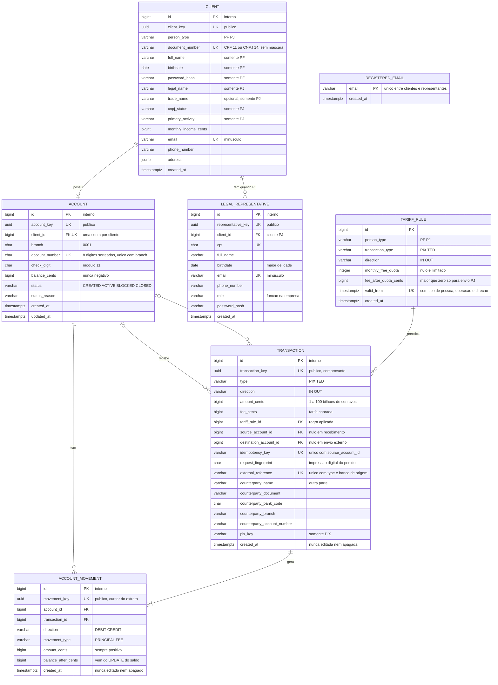

# RFC — Conta transacional PF/PJ com PIX, TED e tarifas

| | |
|---|---|
| **Time** | Maria Eduarda Oliveira · Pedro Siqueira |
| **Data** | 08/10/2026 |
| **Versão** | 7 — modelo implementado: envio síncrono, tarifa com cota mensal e extrato |

## Contextualização

### Entendendo o problema

O sistema cadastra pessoas físicas (CPF) e jurídicas (CNPJ, com representante legal), abre uma conta para cada cliente e movimenta dinheiro só por PIX e TED: recebimentos de outros bancos, envios entre clientes do banco e envios para outros bancos. A garantia central é sobre o dinheiro: nenhum envio é executado duas vezes, nenhum saldo fica negativo e nenhum centavo é criado ou perdido, mesmo com pedidos simultâneos, cliques repetidos ou um banco externo que não responde. A tarifa precisa ser a correta para o tipo de cliente e para os envios do mês, e o extrato precisa reconstruir o saldo linha a linha. Se algo der errado, o pedido é recusado por inteiro e nada muda. Fora do escopo: login, MFA, antifraude, estorno, envio pendente com reconciliação, depósito e saque, cartões, boletos, crédito e integração real com SPI/STR.

### Explicando a solução de forma macro

Um único `Client`, discriminado por `person_type`, representa PF ou PJ; `LegalRepresentative` existe apenas para PJ, e `Account` guarda o saldo e o estado da conta. Toda movimentação é uma `Transaction` (PIX ou TED, de entrada ou de saída) que só é gravada se deu certo, na mesma transação de banco de dados que muda os saldos e cria os `AccountMovement`: as linhas imutáveis do extrato, separadas em valor principal e tarifa. O envio é **síncrono**: para um cliente do banco, o dinheiro muda de conta ali mesmo; para outro banco, o sistema pergunta ao Banco Central (simulado por um Mockserver), espera a resposta por tempo limitado e só registra se ele confirmar. A tarifa vem de uma `TariffRule` com vigência, e a transação guarda a regra e o valor cobrados. Recebimentos chegam por webhook do Banco Central e são creditados uma única vez por referência da rede.

- **Separar clientes PF e PJ em tabelas independentes** — descartado porque duplicaria identidade, contato e relacionamento com a conta. Ganharia se os dois cadastros passassem a evoluir de forma independente.
- **Transação com estados, autorização com MFA e análise de risco persistida** (versão 6 deste RFC) — descartado pelo prazo e pela orientação de manter o núcleo simples: cada estado novo cria caminhos de falha a testar e defender. Ganharia em produção, com usuários autenticados e integração real.
- **Envio externo assíncrono, com estado pendente e reconciliação** — descartado porque exige conferência posterior e estorno. Ganharia se o Banco Central fosse lento ou instável a ponto de o tempo limite recusar envios válidos com frequência.
- **Persistir uma tabela de extrato** — descartado porque duplicaria os movimentos e poderia divergir do saldo. Ganharia como projeção reconstruível, se o volume de leitura exigisse.

## Implementação

### Rotas

Todas as rotas exigem o cabeçalho `INTERNAL-TOKEN`; sem ele, `403`. Todo erro devolve `title`, `description`, `translation` e um código `QIT…` específico; nenhuma resposta expõe id interno. Risco aceito nesta entrega: sem login, quem tem o token acessa qualquer conta, e a regra de responder `404` para recurso de outra pessoa (R8) ainda não se aplica.

| Método | Caminho | O que faz | Entrada (campos que importam) | Saídas (status e quando) |
|---|---|---|---|---|
| `POST` | `/clients` | Cadastra PF ou PJ | `person_type`; PF: CPF, nome, nascimento, senha; PJ: CNPJ, razão social, atividade e `legal_representative`; e-mail, contato, endereço | `201` com `client_key`; `400` campos incompatíveis com o tipo; `422` CPF/CNPJ inválido, menor de idade ou CNPJ inelegível; `409` documento, CPF de representante ou e-mail já cadastrado. Não é idempotente; as restrições únicas impedem duplicata. |
| `GET` | `/clients/{client_key}` | Consulta cliente | `client_key` | `200`; `404` inexistente. Leitura. |
| `POST` | `/clients/{client_key}/accounts` | Abre a conta | `client_key`; corpo vazio | `201` com `account_key`; `404` cliente inexistente; `409` cliente já tem conta (`UNIQUE(client_id)`, mesmo com pedidos simultâneos). |
| `GET` | `/accounts/{account_key}` | Consulta conta e saldo | `account_key` | `200`; `404` inexistente. Leitura. |
| `PATCH` | `/accounts/{account_key}` | Bloqueia, reativa ou encerra | `status`, `reason` | `200`; `400` corpo inválido; `404` inexistente; `409` transição proibida ou encerramento com saldo. Idempotente: pedir o estado atual não muda nada. |
| `POST` | `/accounts/{account_key}/transactions` | Envia PIX ou TED | cabeçalho `Idempotency-Key`; `type`, `amount_cents`; `pix_key` (PIX) ou banco, agência e conta (TED) | `201` concluída; `200` repetição do mesmo pedido; `400` corpo ou chave inválidos; `404` conta, destino ou chave PIX inexistente; `422` saldo insuficiente, conta inativa, envio para a própria conta, Banco Central recusou ou chave reutilizada com outro pedido; `503` Banco Central sem resposta a tempo. Idempotente por `(source_account_id, idempotency_key)` e impressão digital do pedido. |
| `POST` | `/webhook/central_bank/teds` e `/pix` | Credita um recebimento | `external_id`, `amount_cents`, pagador; TED: agência e conta; PIX: chave | `201` creditado; `200` aviso repetido; `400` corpo inválido; `404` conta ou chave inexistente; `422` referência reutilizada com outro conteúdo ou conta inativa. Idempotente por `(type, banco de origem, external_reference)`. |
| `GET` | `/accounts/{account_key}/statement` | Extrato paginado | `limit` (1 a 100, padrão 50), `after` (cursor `movement_key`) | `200` com movimentos e `next_cursor`; `400` parâmetro inválido, inclusive cursor vazio ou com mais de 64 caracteres; `404` conta inexistente; `422` cursor de outra conta ou que não existe. Leitura. |

### Banco de Dados (Somente diagrama)

### Fluxos

**Cadastro de cliente — caminho feliz**

1. O schema escolhe as regras pelo `person_type`. PF: CPF válido, maior de idade, senha com Argon2id. PJ: CNPJ válido, situação cadastral ativa (consulta simulada) e representante adulto.
2. Cliente e representante são gravados na mesma transação de banco; o e-mail entra em `registered_email`. A resposta traz só `client_key`.

**Cadastro de cliente — falha: documento ou e-mail repetido**

1. Dois cadastros simultâneos com o mesmo e-mail disputam a chave primária de `registered_email`: o segundo espera o primeiro e recebe `409`.
2. A transação é desfeita por inteiro; nenhum cadastro parcial permanece. Nenhuma mensagem expõe CPF ou CNPJ.

**Envio PIX/TED — caminho feliz**

1. Se a `Idempotency-Key` já foi usada nesta conta, devolve a transação existente (`200`) quando o pedido é o mesmo.
2. Localiza o destino: chave PIX de cliente nosso ou TED com o código do banco (`999`) é envio interno; o resto vai para outro banco.
3. Trava as contas envolvidas com `SELECT … FOR UPDATE`, sempre na ordem do `id` (menor primeiro), e confere que estão `ACTIVE`.
4. Com a conta travada, conta os envios do mesmo tipo no mês de Brasília e aplica a `TariffRule` vigente: PJ tem 20 PIX e 2 TED grátis por mês e depois paga 99 e 499 centavos; PF e recebimentos não pagam.
5. Envio interno: grava a transação com `ON CONFLICT (source_account_id, idempotency_key) DO NOTHING`, que reserva a chave; debita valor e tarifa num único `UPDATE … SET balance_cents = balance_cents - total WHERE balance_cents >= total RETURNING balance_cents`; credita o destino e cria os movimentos (principal e tarifa na origem, principal no destino) com o saldo que o `UPDATE` devolveu: na origem, o principal registra o saldo antes da tarifa e a tarifa, o saldo final.
6. Envio externo: debita da mesma forma, pergunta ao Banco Central e espera até 5 segundos; com a confirmação, grava a transação com os dados do recebedor e os movimentos da origem.
7. Tudo é confirmado num único commit. O recebedor recebe o valor cheio; a tarifa é uma linha separada no extrato de quem enviou.

**Envio PIX/TED — falha: saldo, concorrência ou Banco Central**

1. Se o `UPDATE` não afeta nenhuma linha, o saldo não cobre valor e tarifa: rollback, `422`, e a chave de idempotência e a cota continuam livres. Sem saldo, o Banco Central nem é chamado.
2. Pedidos simultâneos na mesma conta esperam a trava; o segundo relê saldo e cota. Dois envios cruzados (A→B e B→A) pedem as travas na mesma ordem e não travam um ao outro.
3. Dois cliques com a mesma chave: o segundo espera a trava e confere a chave de novo antes de debitar (e o `ON CONFLICT` garante no banco), então recebe a mesma transação, sem novo débito nem nova chamada ao Banco Central. A mesma chave com outro pedido recebe `422`.
4. Banco Central recusa (`422`) ou não responde a tempo (`503`): rollback do débito, nada é gravado e o cliente pode tentar de novo. Risco aceito: se ele confirmar e a resposta se perder, o envio é recusado aqui, e a correção exigiria reconciliação, que está fora do escopo.

> ## Principal desafio
>
> - **Qual é:** nenhum débito duplicado, saldo negativo ou vaga grátis usada duas vezes, com pedidos simultâneos, retentativas e um banco externo que pode não responder.
> - **Por que é difícil:** ler o saldo, calcular e gravar perde atualizações sob concorrência; travas em ordens diferentes geram deadlock; e o pedido repetido pode chegar enquanto o primeiro ainda está em andamento.
> - **Como o desenho resolve:** débito atômico condicional no próprio `UPDATE`; travas sempre na ordem do `id`; chave de idempotência única por conta, conferida de novo depois da trava e garantida pelo `ON CONFLICT`; cota contada com a conta travada; e transação, movimentos e saldos num único commit. Testes black box provam: 20 transferências cruzadas simultâneas, duplo clique (interno e para outro banco), dois envios disputando a última vaga grátis e conservação do dinheiro (soma dos saldos = recebido − enviado para fora − tarifas).

**Recebimento PIX/TED — caminho feliz**

1. O Banco Central avisa pelo webhook. A conta é encontrada pela chave PIX (CPF da PF, CNPJ da PJ ou e-mail) ou por agência, número e dígito.
2. A transação é gravada com `ON CONFLICT` na referência da rede; o saldo é creditado por `UPDATE` atômico e o movimento de crédito nasce com o saldo do `RETURNING`, no mesmo commit.

**Recebimento PIX/TED — falha: aviso repetido ou conta inválida**

1. O mesmo aviso repetido devolve a transação existente (`200`) sem creditar de novo; a mesma referência com outro conteúdo recebe `422`.
2. Conta ou chave inexistente recebe `404`; conta bloqueada ou encerrada recebe `422`. Nada é gravado, e o aviso pode ser reenviado depois.

**Extrato — caminho feliz**

1. Lê os `AccountMovement` da conta do mais recente para o mais antigo, em páginas de até `limit` linhas, a partir do `movement_key` informado em `after`.
2. Cada linha traz data em Brasília, descrição, valor com sinal, saldo depois e a transação; a tarifa aparece separada do valor. A soma das linhas é o saldo atual.

**Extrato — falha: cursor inválido**

1. Cursor de outra conta ou que não existe recebe `422`; cursor vazio ou longo demais, `400`; conta inexistente, `404`.
2. Um movimento novo entra no topo e não desloca as páginas seguintes, porque a próxima página começa abaixo do `id` da última linha vista.
